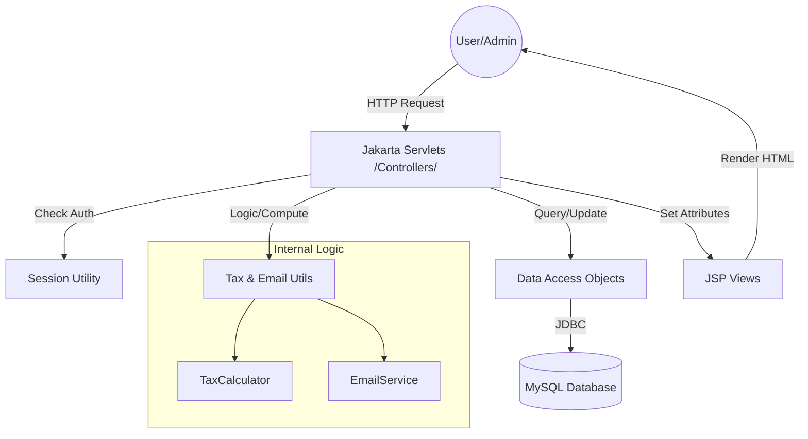

# 🏗️ PayPulse v2.0 — System Design & Architecture

This document provides a technical overview of the **PayPulse Enterprise Payroll Management System** architecture, design patterns, and data flow.

---

## 1. System Overview
PayPulse is a full-stack Jakarta EE web application designed to automate employee management, attendance tracking, leave processing, and complex payroll accounting with statutory tax compliance.

---

## 2. Technical Stack
| Layer | Technology |
|-------|------------|
| **Frontend** | JSP, JSTL, Vanilla CSS (Glassmorphism), Chart.js |
| **Backend** | Java 11, Jakarta Servlet 5.0 (Tomcat 10+) |
| **Database** | MySQL 8.x |
| **Security** | Session-based Auth, SQL Injection Protection (JDBC) |
| **Integrations** | JavaMail API (SMTP), Dotenv (Config) |
| **Build Tool** | Apache Maven |

---

## 3. Architectural Pattern: MVC
The system follows the **Model-View-Controller (MVC)** architectural pattern to ensure separation of concerns:

- **Model**: Located in `com.payroll.model`. These are Plain Old Java Objects (POJOs) representing the data entities (Employee, Payroll, Attendance, etc.).
- **View**: Located in `/WEB-INF/views/`. JSP files using JSTL tags for dynamic content rendering. Protected under `WEB-INF` to prevent direct browser access.
- **Controller**: Located in `com.payroll.servlet`. Servlets that handle HTTP requests, interact with DAOs, and route to appropriate views.

---

## 4. System Architecture Diagram



---

## 5. Database Design (Schema v2.0)
The system uses a relational database with 7 core tables:

- **`departments`**: Organizational structure.
- **`designations`**: Roles linked to departments.
- **`employees`**: Central profile storage with ESS login credentials.
- **`attendance`**: Daily presence and overtime tracking.
- **`leaves`**: Request and approval workflow.
- **`leave_balance`**: Accrual and usage tracking.
- **`payroll`**: Snapshot of salary disbursements including detailed tax line-items.

---

## 6. Core Logic & Workflow

### 💰 Payroll Computation Engine
Located in `TaxCalculator.java`, the system calculates salary using the following formula:
1.  **Gross Earnings** = `Basic` + `HRA (20%)` + `DA (10%)` + `Bonus (5%)`
2.  **Statutory Deductions**:
    *   **PF**: 12% of Basic.
    *   **ESI**: 0.75% of Gross (if Gross < ₹21k).
    *   **TDS**: Slab-based monthly projection of annual income.
3.  **Attendance Impact**:
    *   **LOP**: `(Basic / WorkingDays) * AbsentDays`.
4.  **Net Salary** = `Gross` - `(PF + ESI + TDS + LOP)`.

### 📧 Automated Notifications
When an Admin generates payroll:
1.  The record is persisted in the `payroll` table.
2.  `EmailService` is triggered asynchronously.
3.  An HTML-formatted payslip summary is sent to the employee's registered email via SMTP.

### 🔒 Security Model
- **Admin Role**: Full access to all modules (Departments, Employees, Attendance, Reports).
- **Employee Role (ESS)**: Restricted access to their own profile, attendance, and payroll history.
- **Session Guards**: Centralized in `SessionUtil.java` to prevent unauthorized endpoint access.

---

## 7. Folder Structure
```bash
PayPulse/
├── src/main/java/com/payroll/
│   ├── dao/      # Database Interaction (CRUD)
│   ├── model/    # Data Entities (POJOs)
│   ├── servlet/  # Controllers (Request Handling)
│   └── util/     # Business Logic & Utilities
├── src/main/webapp/
│   ├── css/      # UI Styling
│   ├── public/   # Static Assets (Images)
│   └── WEB-INF/  # Views & Config
└── database/     # SQL Schema scripts
```
